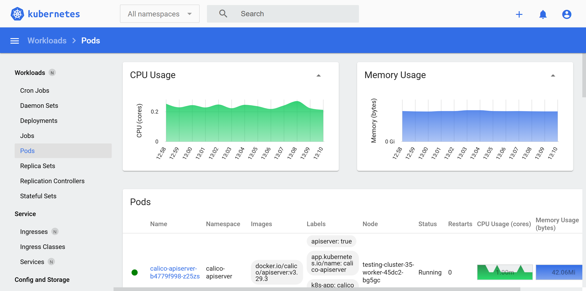
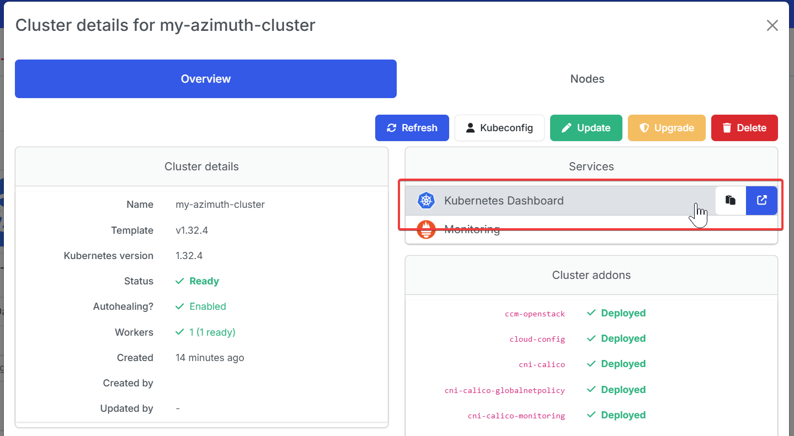

---
hide:
  - footer
---

## Introduction
The Kubernetes Dashboard Web UI is available for deployed Kubernetes platforms on Azimuth. This provides a user-friendly way to administer a cluster.

For usage information, see the [Kubernetes Docs](https://kubernetes.io/docs/tasks/access-application-cluster/web-ui-dashboard/#welcome-view).

### Accessing Kubernetes Dashboards
Kubernetes Dashboard can be accessed via the link in the cluster details
{ loading=lazy }

Kubernetes Dashboard can be enabled/disabled on an existing cluster using the green  `Update` button in details, under the Cluster Addons section.

Access can be granted through the [Identity Provider](../../identity_provider/identity_provider.md).

!!! Info
    We recommend access to administrating clusters, through the Kubernetes Dashboard or through the CLI (Kubectl), be limited to users who already have admin access via your OpenStack project. This is because users with access can create, delete or modify resources in your cluster(s). If granting access to other users is necessary, we recommend it is only to the Kubernetes Dashboard via the Identity Provider as this can be revoked later. Permission to generate a kubeconfig file for CLI usage cannot be granted through azimuth to non-admin users, the kubeconfig file can only be shared manually which we do not recommend.